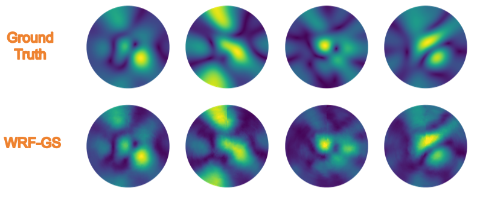

# WRF-GS: Wireless Radiation Field Reconstruction with 3D Gaussian Splatting
Chaozheng Wen, Jingwen Tong, Yingdong Hu, Zehong Lin and Jun Zhang<br>

Thanks for your interest in our work. This repository contains the official implementation associated with the paper " WRF-GS: Wireless Radiation Field Reconstruction with 3D Gaussian Splatting", which has been accepted for INFOCOM 2025 [ArXiv](https://arxiv.org/abs/2412.04832).

Abstract: Wireless channel modeling plays a pivotal role in designing, analyzing, and optimizing wireless communication systems. Nevertheless, developing an effective channel modeling approach has been a longstanding challenge. This issue has been escalated due to the denser network deployment, larger antenna arrays, and wider bandwidth in 5G and beyond networks. To address this challenge, we put forth WRF-GS, a novel framework for channel modeling based on wireless radiation field (WRF) reconstruction using 3D Gaussian splatting. WRF-GS employs 3D Gaussian primitives and neural networks to capture the interactions between the environment and radio signals, enabling efficient WRF reconstruction and visualization of the propagation characteristics. The reconstructed WRF can then be used to synthesize the spatial spectrum for comprehensive wireless channel characterization. Notably, with a small number of measurements, WRF-GS can synthesize new spatial spectrums within milliseconds for a given scene, thereby enabling latency-sensitive applications. Experimental results demonstrate that WRF-GS outperforms existing methods for spatial spectrum synthesis, such as ray tracing and other deep-learning approaches.

<p align="center">
  
 
</p>

## Installation
Create the basic environment
```python
conda env create --file environment.yml
conda activate wrfgs
```
Install some extensions
```python
cd submodules
pip install ./simple-knn
pip install ./diff-gaussian-rasterization # or cd ./diff-gaussian-rasterization && python setup.py develop
pip install ./submodules/fused-ssim
```

## Training & Evaluation
Due to file size limitations, a small dataset is included to help quickly verify the code, which can be executed using the following command:
```python
python train.py
```
More datasets can be found [here](https://github.com/XPengZhao/NeRF2?tab=readme-ov-file).<be>

**Note:** As the amount of training data changes, you may need to adjust the total `iterations (./arguments/__init__.py)` and `learning rate (./scene/gaussian_model.py)`.

**Upcoming revision:** The issue of frequently adjusting model parameters due to changes in data volume has now been resolved. The new model structure and methods will be updated in the near future or in subsequent work. (Currently, testing shows an improvement of approximately 8% to 10% in SSIM values; stay tuned for updates).
## To-Do List
- [ ] Implementation on [gsplat](https://github.com/nerfstudio-project/gsplat) to speed up the code.
- [ ] Release more case study code.
- [ ] Optimized code is applicable to more scenarios.


## BibTex
If you find this work useful in your research, please cite:
```bibtex
@article{wen2024wrf,
  title={WRF-GS: Wireless Radiation Field Reconstruction with 3D Gaussian Splatting},
  author={Wen, Chaozheng and Tong, Jingwen and Hu, Yingdong and Lin, Zehong and Zhang, Jun},
  journal={arXiv preprint arXiv:2412.04832},
  year={2024}
}
```
## Acknowledgment
Thanks to the [NeRF2](https://github.com/XPengZhao/NeRF2?tab=readme-ov-file) author for his help. And some code snippets are borrowed from [3DGS](https://github.com/graphdeco-inria/gaussian-splatting/tree/main).
